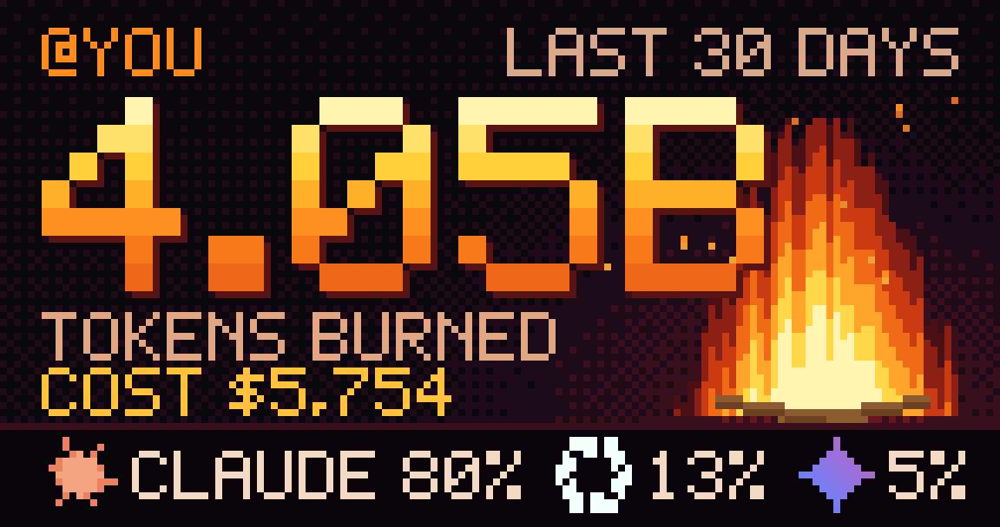
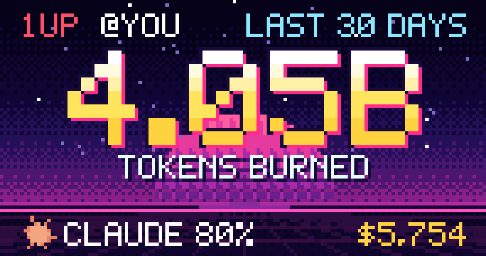
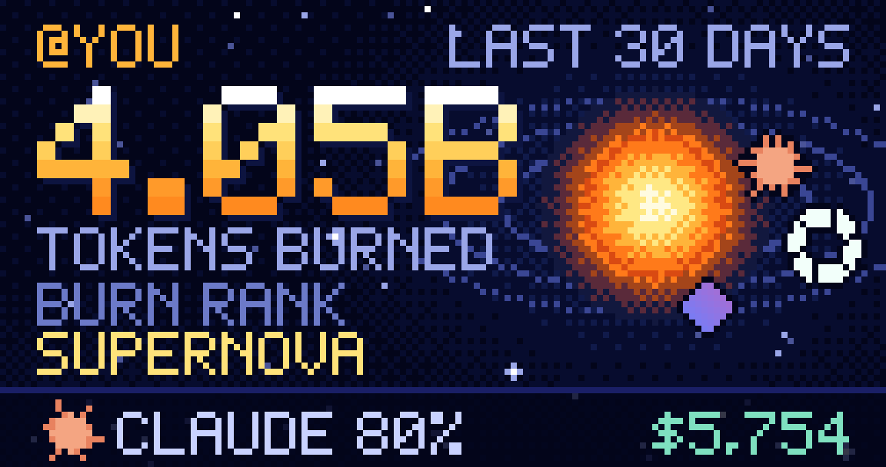
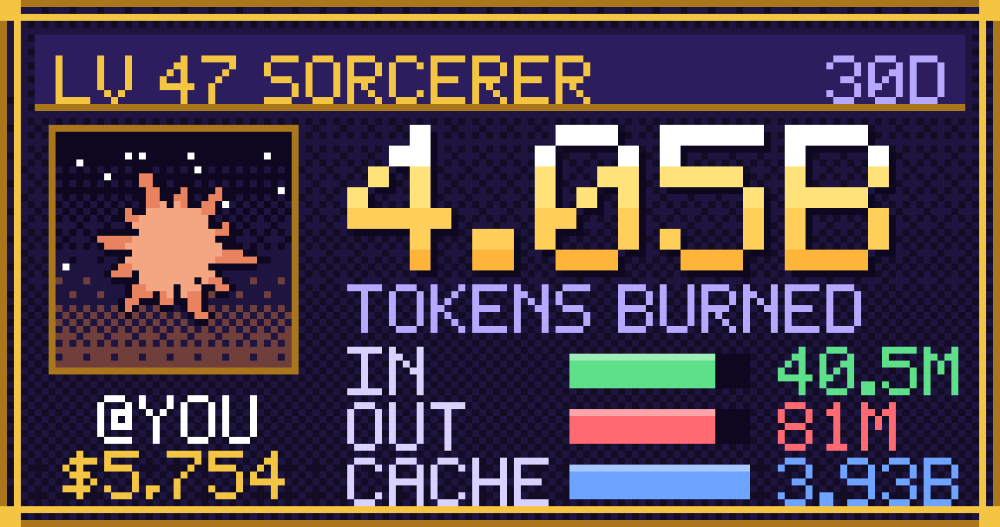

# Token Burn

**Share your token burn.** Pixel-art cards of your AI token usage, for any time window you like: all time, 90 days, 30 days, a week, a day, an hour, or exact dates.

Usage numbers come from [tokscale](https://github.com/junhoyeo/tokscale), which reads your local logs from Claude Code, Codex, Gemini, Cursor, OpenCode and 40+ other tools. tokenburn is only the card layer on top.

## Quick start with any AI

Copy this prompt into Claude, ChatGPT, Codex, Cursor, or any AI assistant:

```text
Set up Token Burn for me: https://github.com/uvesarshad/tokenburn
It's a CLI that makes shareable pixel-art cards of my AI token usage.

1. Check I have Node 18+ and tokscale (install tokscale with: npm i -g tokscale).
2. Install it with: npm i -g @uvesflow/tokenburn
   (if that fails, git clone the repo and run npm link inside it).
3. Ask me which time window (1h, 24h, 7d, 30d, 90d, all), which theme
   (furnace, arcade, galaxy, quest), and whether to show my handle and cost.
   Then run: tokenburn <window> -t <theme> --no-preview
   and tell me where the PNG card was saved (it goes in ./tokenburn-cards/).
4. Finish by giving me the two commands to use anytime:
   npm i -g @uvesflow/tokenburn   (install, once)
   tokenburn                      (makes a 30-day card by default)

If you can't run commands yourself, just walk me through these steps.
```

| Furnace | Arcade |
|:---:|:---:|
|  |  |
| **Galaxy** | **Quest** |
|  |  |

_Example cards use built-in demo data (`--demo`)._

## Install

Requires Node 18+ and [tokscale](https://github.com/junhoyeo/tokscale) (`npm i -g tokscale`). If tokscale isn't installed, Token Burn falls back to `npx tokscale@latest`.

```bash
npm i -g @uvesflow/tokenburn
```

Use `-g` (global). Without it the `tokenburn` command isn't added to your PATH. To try it without installing anything, run `npx @uvesflow/tokenburn`.

Or from source:

```bash
git clone https://github.com/uvesarshad/tokenburn.git
cd tokenburn
npm link
```

Then:

```bash
tokenburn                 # last 30 days (the default), saved to ./tokenburn-cards/
```

## Usage

```bash
tokenburn 7d -t arcade                 # last 7 days, arcade theme
tokenburn all -t galaxy -n @you        # all time, with your handle on the card
tokenburn 1h                           # what did the last hour cost?
tokenburn 90d --no-cost                # leave the dollar amount off
tokenburn --since 2026-09-01 --until 2026-09-15 -t quest
tokenburn 30d -t all --out-dir cards/  # one card per theme
tokenburn 30d -c claude,codex          # only count some tools
tokenburn 30d --json                   # just print the numbers
tokenburn --demo                       # try it with made-up data
```

**Durations:** `all`, `today`, `1h`, `6h`, `24h`, `7d`, `30d`, `90d`, `2w`, `3mo`, `1y`, or any `<number><h|d|w|mo|y>`. Exact bounds: `--since` / `--until` (`YYYY-MM-DD` or `YYYY-MM-DDTHH:MM`, local time; a bare `--until` date includes that whole day).

**Themes:** `furnace` (default), `arcade`, `galaxy`, `quest`, plus `all` and `random`. `tokenburn --list-themes` describes them.

Cards are saved in a `tokenburn-cards/` folder in the current directory. That folder ignores itself in git, so your cards never get committed by accident. Use `--out-dir <folder>` or `-o <file>` to save elsewhere.

Each card is a 1152x608 PNG (the pixels are drawn at 144x76 and scaled up 8x with hard edges, so it stays crisp). On a terminal at least 144 columns wide the card is also drawn inline: screenshot that if you prefer. Use `--no-preview` to skip it or `--preview` to force it.

## What's on a card

- Total tokens (input + output + cache reads/writes, the same definition tokscale uses) and, optionally, estimated cost
- The AI brands you burned tokens on, with pixel logos and their share (Claude, OpenAI, Gemini, Grok, Cursor, Copilot and generic badges for the rest)
- A burn rank that grows with the total (SPARK, EMBER, CAMPFIRE, BONFIRE, INFERNO, SUPERNOVA, STAR FORGE, DYSON SWARM), and per theme extras such as a bonfire that scales with the rank, or RPG level and class
- Your handle if you pass `--name`

Cards contain **only aggregate numbers**. No project names, paths, prompts or session ids ever reach the image.

## How it works

1. `tokscale hourly --json` gives usage in whole-hour buckets, and `tokscale graph` gives exact per-model totals per day.
2. Hours where several models were active are split using that day's per-model totals (single-model hours, the common case, are exact).
3. The window is applied: an hour bucket counts when its midpoint falls inside the window, so `1h` means about one bucket. **Precision is one hour**, not one minute.
4. A tiny zero-dependency renderer draws the card into a pixel buffer, writes it as PNG (own encoder) and can also print it as terminal half-blocks.

Each `tokenburn` run takes a few seconds, mostly tokscale scanning your logs.

## Add a theme

A theme is one file in `src/themes/` exporting `{ id, name, description, draw(canvas, stats, ctx) }`, then add it to `src/themes/index.js`. `stats` has `tokens`, `cost`, `brands`, `models`, `tier`, `period`, `timeline(n)` and more (run with `--json` to see it). The canvas is 144x76 with helpers for rectangles, lines, discs, ordered dithering, the 5x7 font (`canvas.text`) and logos (`logo(brand, size)`).

```bash
npm test          # unit tests, including a render smoke test for every theme
npm run demo      # writes one demo card per theme to ./out
```

## Notes

- The logos are stylised pixel homages generated in code, not official artwork; the brand names and marks belong to their owners.
- Costs are tokscale's estimates from public list prices, not your actual bill.

## License

MIT
